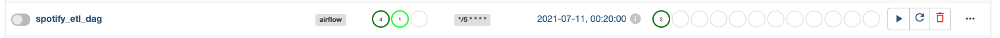

# Spotify - Apache Airflow & Redshift ETL

## Project Overview

This project is an ETL using Spotipy and general a weekly email of all the songs played and web scraper additionnal information for each artist listenned.

This program uses Spotipy, Regex, Apache Airflow and AWS Redshift.

After the extraction, (1)a web scraper get additionnal information (e.g. birthday of the artist) (2) and transform the data using python to clean it up, create unique identifiers, and load it into a Redshift database.

The loading step uses (1) SQL to query the data (2) and python to automate a weekly email that gets sent to my email giving a summary of my Spotify listening for that week.

```
The S3 bucket is under the region: us-west-2
The Redshit DB is under: us-east-2
```

### Preview



# Resources

- create_tables.py : drops (clear) all tables and create all tables

- python spotify_load_job.py : load the file api/data/db_etl.csv into AWS Redshift

- sql_queries.py : contain all SQL queries with executing create_tables.py

- create_cluster_redshift.py : create the initial redshift cluster and an IAM role to access other AWS services S3

- delete_cluster_redshift.py : delete redshift cluster and IAM role created and you will avoid an invoice.

- dwh.cfg : contains configurations for AWS Redshift database and must be edited

- .env

```
# Development settings

CLIENT_ID=SPOTIFY_DEV
CLIENT_SECRET=SPOTIFY_DEV

# AWS

KEY_IAM_AWS=AIM_AWS
SECRET_IAM_AWS=AIM_AWS
```

#### Command

- Create Redshift

  - python create_cluster_redshift.py

- Initialize Redshift Database

  - python create_tables.py

- Upload api/data/db_etl.csv to S3 and to SQL Redshift

  - python spotify_load_job.py

- Delete Redshift

  - python delete_cluster_redshift.py

### Venv

> python3 -m venv env

> source env/bin/activate

> cd api && export AIRFLOW_HOME=$PWD

---

> pip freeze > requirements.txt (To generate a txt)

> pip install -r requirements.txt

## Airflow Installation

> airflow db init

> cd api && airflow scheduler

> cd api && airflow webserver

Do not forget to either change the guest setting to public or create an admin user.

### AWS Redshift

Redshift is a fully managed, cloud-based, petabyte-scale data warehouse service by Amazon Web Services (AWS). This solution offer to collect and store all data and enables analysis using various business intelligence tools like Power BI.


> EC2 - Security Groups - default

> Select Redshift from the Type dropdown menu

> You now have 2 new Redshift rules (0.0.0.0/0 AND ::/0)

#### IAM Access

- IAM user in our AWS account Give it AdministratorAccess

## Web Scraper

Using Beautiful Soup, the python service is schedule to confirm the birthday date and the release date from:

- Wikipedia
- musicbrainz.org

## References

- https://ruslanmv.com/blog/Create-Data-Warehouse-with-Redshift

- https://hevodata.com/learn/load-csv-to-redshift-3-easy-methods/

```

```
