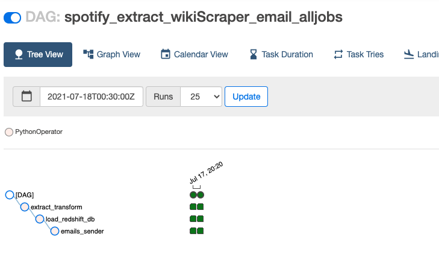
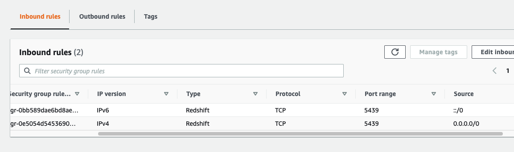

# Spotify - Apache Airflow & Redshift ETL


## Project Overview



This project is an ETL using Spotipy and generate a weekly email of all the songs played and web scraper additionnal information for each artist listenned. I build an ETL pipeline for a data lake hosted on S3 and Redshift. Therefore I fetch data from the API, clean & process the data into analytics tables using Python, and load them back into S3 & Redshift.

> This program uses: Spotipy, Regex, Apache Airflow and AWS Redshift.

After the extraction, (1) a web scraper get additionnal information (e.g. birthday of the artist) (2) and transform the data using python to clean it up, create unique identifiers, and load it into an AWS Redshift database.

The loading step uses (1) SQL to query the data (2) and python to automate a weekly email that gets sent to my email giving a summary of my Spotify listening for that week.


```
The S3 bucket is under the region: us-west-2
The Redshit DB is under: us-east-2
```

### Preview


# Resources

- create_tables.py : drops (clear) all tables and create all tables

- python spotify_load_job.py : load the file api/data/db_etl.csv into AWS Redshift

- sql_queries.py : contain all SQL queries with executing create_tables.py

- create_cluster_redshift.py : create the initial redshift cluster and an IAM role to access other AWS services S3

- delete_cluster_redshift.py : delete redshift cluster and IAM role created and you will avoid an invoice.

#### To run this project in local mode, create a file "dwh.cfg" and ".env" in the root of this project with the following data:

- dwh.cfg : contains configurations for AWS Redshift database and must be edited (To run in the folder api/dags, please use config.read('../../dwh.cfg') to be able to run it)

- Below is for ".env"

```
# Development settings

CLIENT_ID=SPOTIFY_DEV
CLIENT_SECRET=SPOTIFY_DEV

# AWS

KEY_IAM_AWS=AIM_AWS
SECRET_IAM_AWS=AIM_AWS

LOG_DATA='Please of the csv in S3' # Keep the ''
```

### Data Pipeline Design

- The ETL pipeline uses Python (pandas), that simplifies data manipulation and the exportation to a csv and boto3 also allows connection to Redshift Database. At this moment, the data are store as a staging stage with the structure below:

```
   CREATE TABLE staging_events_table (
      id VARCHAR(500) PRIMARY KEY,
      song_id VARCHAR(500),
      song_name VARCHAR(500),
      img VARCHAR(500),
      duration_ms VARCHAR(500),
      song_explicit VARCHAR(500),
      url VARCHAR(500),
      popularity VARCHAR(500),
      date_time_played VARCHAR(500),
      album_id VARCHAR(500),
      artist_id VARCHAR(500),
      scraper1 VARCHAR(500),
      scraper2 VARCHAR(500)
    )
   """
```

## Commands

### Venv

> python3 -m venv env

> source env/bin/activate

> cd api && export AIRFLOW_HOME=$PWD

---

> pip freeze > requirements.txt (To generate a .txt)

> pip install -r requirements.txt

## Airflow Installation

> airflow db init

> cd api && airflow scheduler | TO RUN DO NOT FORGET cd api && export AIRFLOW_HOME=$PWD

> cd api && airflow webserver | TO RUN DO NOT FORGET cd api && export AIRFLOW_HOME=$PWD

Do not forget to validate the command: python spotify_load_job.py

```
NOTE: Make sure you set load_example variable to "False" in airflow.cfg file.
```

- Do not forget to either change the guest setting to public OR create an admin user.

#### Running the project

- Step 1: Create Redshift

  - python create_cluster_redshift.py

- Step 2: Initialize Redshift Database

  - python create_tables.py

- Step 3: Refer the section to run Apache Airflow & User https://airflow.apache.org/docs/apache-airflow/stable/security/webserver.html

- Step 4: Upload api/data/db_etl.csv to S3 and to SQL Redshift

  - python spotify_load_job.py (To run the loading process manually)

  - If you run the file spotify_load_job.py in your terminal, the csv will in the folder api/data/db_etl.csv
  - If you generate the file using Airflow, the csv will be inside the folder data/db_etl.csvdata/db_etl.csv

- Step 5: Delete Redshift

  - python delete_cluster_redshift.py (Please do it in order to reduce your invoice)

- Step 6: Staging database ready for analysis in Jupyer

### AWS Redshift

Redshift is a fully managed, cloud-based, petabyte-scale data warehouse service by Amazon Web Services (AWS). This solution offer to collect and store all data and enables analysis using various business intelligence tools like Power BI.



> EC2 - Security Groups - default

> Select Redshift from the Type dropdown menu

> You now have 2 new Redshift rules (0.0.0.0/0 AND ::/0)

#### IAM Access

- IAM user in our AWS account Give it "AdministratorAccess"

## Web Scraper

Using Beautiful Soup, the python service is schedule to confirm the birthday date and the release date from:

- Wikipedia
- musicbrainz.org

## References

- https://ruslanmv.com/blog/Create-Data-Warehouse-with-Redshift

- https://hevodata.com/learn/load-csv-to-redshift-3-easy-methods/

- https://www.astronomer.io/guides/managing-dependencies

- https://www.applydatascience.com/airflow/writing-your-first-pipeline/

- https://github.com/SwagLyrics/SwagLyrics-For-Spotify/blob/master/swaglyrics/cli.py (Lyrics Module)

```

```
